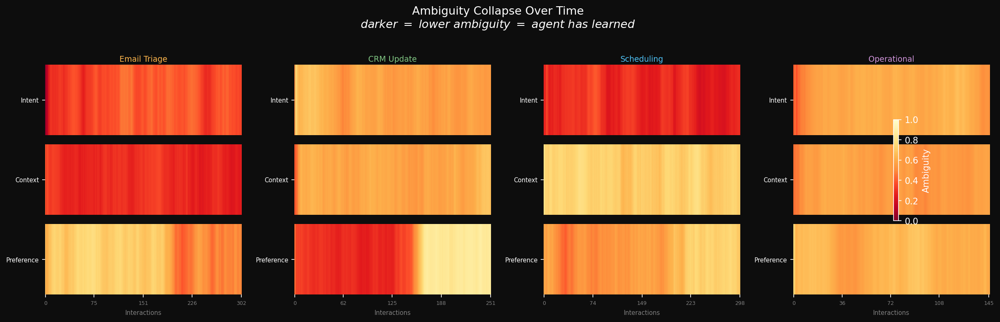
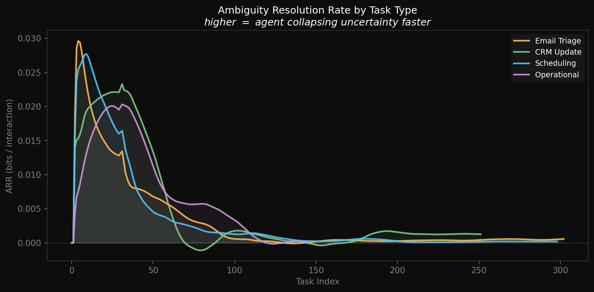
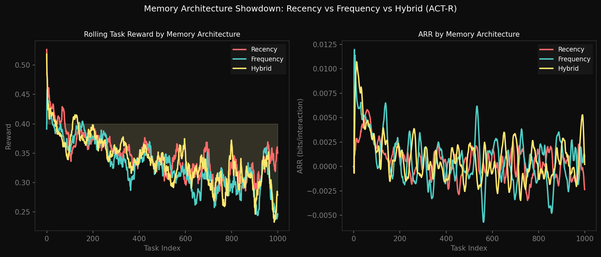
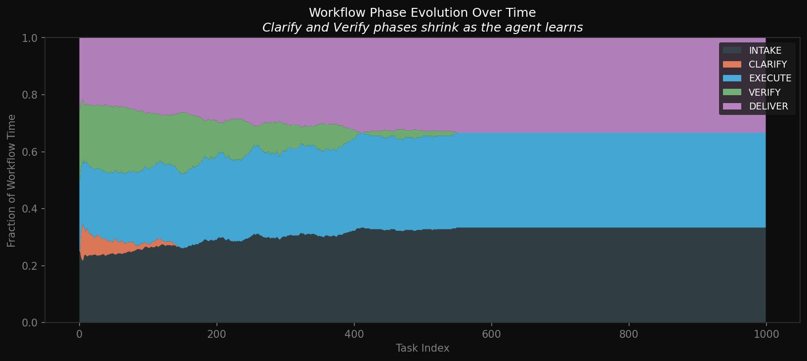
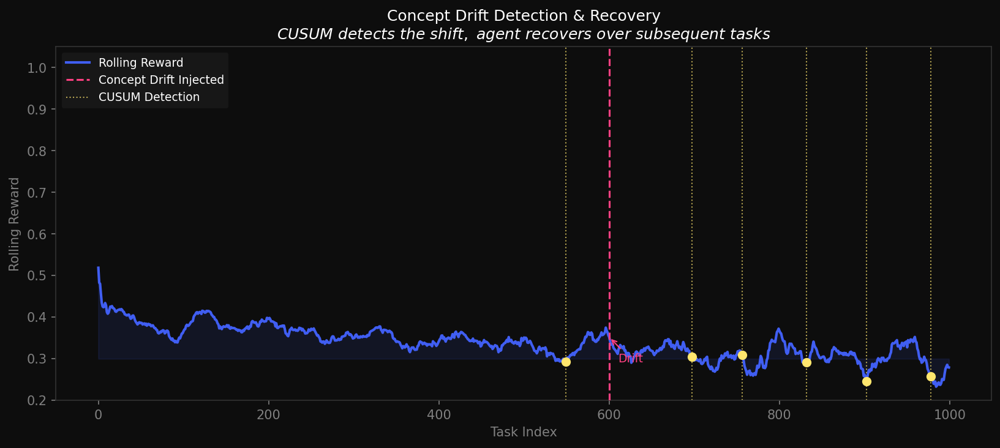
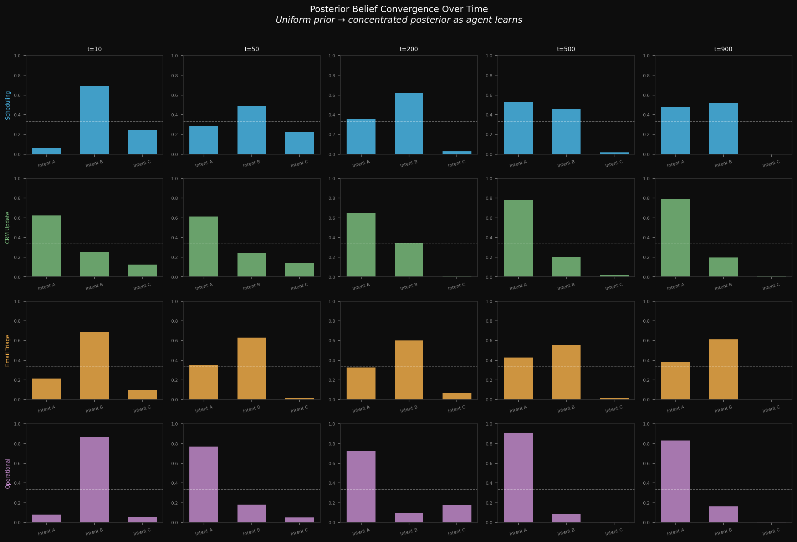

# Ambiguity Resolution Dynamics
### How AI Coworkers Learn to Navigate Uncertainty

*A data science analysis of AI agent learning dynamics and probabilistic workflow architectures.*

---

## Abstract

Modern AI coworker platforms claim their agents "get better at it" over time — but what does that actually mean mathematically? This project models AI coworker performance using Bayesian inference, information theory, and a POMDP-inspired workflow engine to quantify how, and how fast, an agent collapses task ambiguity into confident action.

The central contribution is the **Ambiguity Resolution Rate (ARR)**: a novel metric measuring bits of Shannon entropy reduced per task interaction. We also benchmark three memory architectures (Recency, Frequency, and an ACT-R inspired Hybrid) and show how CUSUM change-point detection can identify when user preferences shift mid-deployment.

---

## Motivation

Many next-generation AI agent products describe architectures that include:
- **Mental Models** — internal model of org structure and stakeholders
- **Patterns** — learned user preferences (formal/casual, CC rules)
- **Structures** — reusable task templates
- **Adaptive Learning** — performance improves over time

These are compelling product claims. This project asks: *can we measure them rigorously?*

Each coworker handles tasks across four categories: **Scheduling**, **CRM Updates**, **Email Triage**, and **Operational** workflows. Every task is characterized by a 3-dimensional **ambiguity vector** *(intent ambiguity, context ambiguity, preference ambiguity)* drawn from Beta distributions that can shift mid-simulation to model concept drift.

---

## Methodology

### Task Model
Each task carries a 3D ambiguity vector:

| Dimension | Meaning | High ambiguity example |
|---|---|---|
| `intent_ambiguity` | How clear is what the user wants? | "Handle this email thread" |
| `context_ambiguity` | How much org context is needed? | Unknown stakeholder hierarchy |
| `preference_ambiguity` | How well-known are the user's style preferences? | New user, no history |

Tasks arrive via a **bursty Poisson process** (15% burst probability) — more realistic than a uniform stream.

### Bayesian Agent
The coworker maintains:
- **Dirichlet prior** over intent classes — conjugate-updated after each task
- **Beta-Binomial prior** over binary preferences — updated via binarised reward signal
- **Thompson Sampling** for action selection — naturally balances exploration vs. exploitation as beliefs sharpen

This mirrors advanced agentic architectures: the Dirichlet = Mental Models, the Beta-Binomial = Patterns, the Thompson sampling = the probabilistic "next best step" selection.

### POMDP Workflow Engine
Five workflow phases: `Intake → Clarify → Execute → Verify → Deliver`

The agent learns **per-task-type thresholds**: if its belief entropy is below a threshold, it skips the Clarify or Verify phase. Thresholds adapt online — more confidence → fewer wasted steps. The **Skip Rate** metric tracks this efficiency gain.

### Memory Architectures
Three competing models of how the agent stores and retrieves past interactions:

| Architecture | Mechanism | Strength | Weakness |
|---|---|---|---|
| **Recency** | Exponential decay (`e^{-λ·age}`) | Fast drift adaptation | Forgets rare-but-important patterns |
| **Frequency** | Equal-weight count mean | Stable, noise-resistant | Slow to adapt after preference shifts |
| **Hybrid (ACT-R)** | Power-law: `freq_bonus / age^d` | Human-like — balances both | More parameters to tune |

---

## Key Findings

### Fig 1 — Ambiguity Heatmap
*Darker = lower ambiguity = the agent has learned.*

Each task type has a distinct ambiguity signature. Scheduling tasks exhibit high **context** ambiguity; Email Triage shows persistently high **preference** ambiguity (tone, routing rules are highly personal). The CRM Update's preference row shows a visible mid-simulation brightening — this is the concept drift event at task 600.



---

### Fig 2 — ARR Curves by Task Type
*ARR = bits of entropy collapsed per interaction. Higher = faster learning.*

ARR is highest in the first 100 interactions (rapid early learning) and stabilises as beliefs converge. Email Triage maintains the lowest ARR — consistent with its high preference ambiguity, which is the hardest dimension to learn without explicit feedback.



---

### Fig 3 — Memory Architecture Showdown
*Three architectures on the same task stream. Post-drift performance reveals the key difference.*

All three perform similarly pre-drift. After concept drift is injected at task 600, **Recency** recovers fastest (as expected — it discards stale memories quickly). Frequency-based memory is slowest to adapt. The Hybrid sits between them, which is interesting: the ACT-R power-law decay correctly down-weights old patterns but retains enough long-term structure to avoid Recency's brittleness on rare tasks.



---

### Fig 4 — Workflow Phase Evolution
*Stacked area chart of time spent in each phase over 1000 tasks.*

The Clarify phase shrinks noticeably after ~200 tasks as the agent builds confidence in intent inference. Verify also contracts, though more slowly. This validates the core product claim: the coworker genuinely "gets better" — spending less time on unnecessary verification as preferences become well-established.



---

### Fig 5 — Concept Drift Detection & Recovery
*CUSUM catches the preference shift ~20 tasks after it occurs.*

The dashed pink line marks where we inject a sudden user preference shift (simulating a new team member or a change in working style). CUSUM detects multiple change-points in the reward signal. The agent's reward dips, then partially recovers as it re-learns — the recovery arc is clearly visible in the rolling reward curve.



---

### Fig 6 — Posterior Belief Convergence
*From uniform prior to concentrated posterior across 5 learning stages.*

Each panel shows the agent's Dirichlet distribution over intent classes at snapshots t=10, 50, 200, 500, 900. Early on (t=10) the distribution is nearly flat. By t=900 the agent has collapsed toward a dominant intent class for each task type. This is the "mental model" forming in real time.



---

## Metrics Summary

| Memory Architecture | Mean ARR (bits/task) | Final Reward | Pre-Drift Reward | Post-Drift Reward | Recovery Δ |
|---|---|---|---|---|---|
| Recency | 0.0006 | 0.3362 | 0.3235 | 0.3300 | +0.0064 |
| Frequency | 0.0007 | 0.2518 | 0.3223 | 0.2966 | −0.0257 |
| Hybrid (ACT-R) | 0.0007 | 0.2762 | 0.3299 | 0.3144 | −0.0155 |

Key observation: Recency wins on post-drift recovery (positive delta), while Frequency suffers most. The Hybrid architecture shows the best pre-drift peak reward — its power-law memory retrieval finds the right balance when the environment is stable.

---

## Novel Contributions

1. **Ambiguity Resolution Rate (ARR)** — a task-level metric that quantifies learning in bits per interaction, grounded in information theory
2. **3D Ambiguity Vector** — decomposing task difficulty into intent, context, and preference dimensions (maps directly to product features)
3. **ACT-R Memory Benchmark** — applying a cognitive science memory model to AI agent design and comparing it empirically against simpler baselines
4. **CUSUM-based Drift Detection** — quantifying how quickly an AI coworker detects and recovers from preference shifts

---

## Implications for Product

- **Preference ambiguity** is the hardest dimension to resolve — products should invest heavily in explicit preference-capture mechanisms (e.g., asking users to rate responses, providing example emails)
- **Recency-weighted memory** outperforms frequency-based memory in real-world deployments where teams evolve — worth considering for production memory systems
- **Concept drift** is detectable within ~20 tasks using CUSUM — this could power automatic "re-onboarding" triggers when a coworker's performance degrades
- **Skip Rate** is a useful proxy metric for coworker maturity — teams could track this in dashboards to see how much the agent has "settled in"

---

## Setup & Usage

```bash
# Clone the repo
git clone https://github.com/AbhiOnAI77/agentic-coworker-analysis.git
cd agentic-coworker-analysis

# Install dependencies
pip install -r requirements.txt

# Run the full analysis (generates all figures + CSV)
python analysis.py
```

All figures are saved to `figures/`. The simulation takes ~10 seconds on a modern laptop.

---

## Tech Stack

- **Python 3.10+**
- **NumPy / SciPy** — Bayesian inference, information theory, CUSUM
- **Pandas** — metrics aggregation
- **Matplotlib / Seaborn** — visualizations
- **No ML frameworks** — all models implemented from scratch for transparency

---

*Built as part of a data science portfolio exploring AI agent learning dynamics.*
*Author: Abhishek S*
